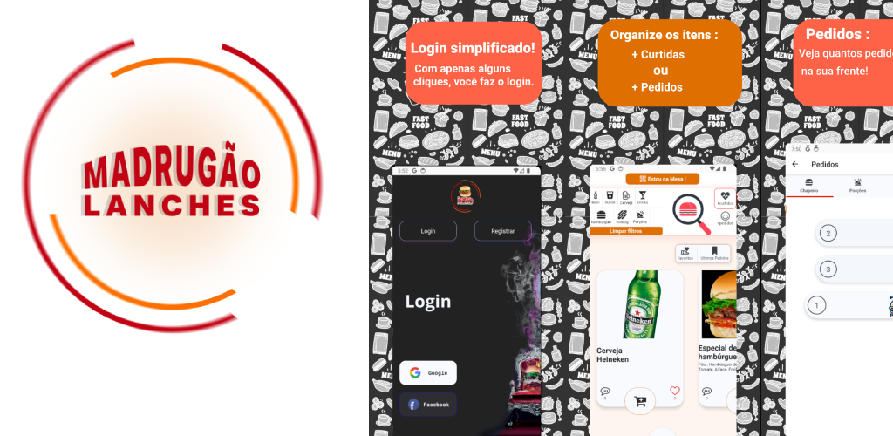

# Madrugão Lanches - Sistema de Atendimento Integrado

Bem-vindo à documentação do projeto **Madrugão Lanches**, desenvolvido para otimizar o atendimento e a gestão de pedidos na empresa de Tupã. Essa documentação apresenta uma visão geral do projeto, mas devido a restrições de tempo, pode não ser tão completa quanto o ideal. 
O app do CLiente esta no Google Play : [Madrugão Lanches](https://play.google.com/store/apps/details?id=com.madrugao.madrugao)

## ✨ Sobre o Madrugão Lanches

Este projeto oferece uma solução completa para o **Madrugão Lanches**, visando modernizar e otimizar o processo de atendimento e gestão de pedidos. O sistema substitui o método tradicional de pedidos em papel por uma plataforma digital eficiente, beneficiando tanto a equipe quanto os clientes.

**Principais vantagens:**

* **Agilidade:** Pedidos são processados e entregues com mais rapidez.
* **Organização:** Pedidos fluem em tempo real para os setores responsáveis (chapa, bar, porções), evitando erros e atrasos.
* **Controle:** Funcionalidades de controle de caixa, emissão de notas fiscais (API FOCUSnfe) e gestão de estoque.
* **Experiência do Cliente:** Pedidos fáceis via aplicativo (com IA Atendente!), na mesa por QR Code, ou pedidos online. Histórico de pedidos e acompanhamento em tempo real. 

---

## 📷 Prints e Vídeos dos Aplicativos

**App Cliente:**

* Telas Iniciais:
    
* Demonstração da IA Atendente: 
     

**App Admin:**

* Gerenciamento de Garçons:
    
* Controle de Caixa:
     

---

## 🚀 Funcionalidades dos Aplicativos

### Cliente Madrugão
Disponível no Google Play, o app permite aos clientes fazer pedidos com facilidade. Principais funcionalidades:

- **IA Atendente:** Com a IA, o cliente pode adicionar itens ao carrinho diretamente a partir de uma conversa.
- **Lista de itens e filtros:** Exibe o cardápio completo, com filtros por categoria e organização dos itens mais pedidos ou curtidos.
- **Curtidas e comentários por item:** Itens podem ser avaliados e comentados por clientes.
- **Lista de pedidos curtidos e últimos pedidos:** Criação de lista personalizada e histórico dos últimos pedidos.
- **Ordem de pedidos:** Visualização da posição do pedido na fila.
- **Pedido Online/Mesa:** Pedidos para entrega ou retirada e opção de pedido diretamente da mesa via QR Code, com atendimento automatizado para chamar garçons.

### Admin
Distribuído internamente, o app para administradores oferece:

- **Gestão de pedidos MESA/ONLINES/OUTROS:** Controle de pedidos nas mesas, pedidos online e pedidos externos (ligação, WhatsApp).
- **Estoque:** Gerenciamento de estoque, adição e edição de itens do cardápio.
- **Controle de Caixa:** Monitoramento do status de abertura e fechamento do caixa, com controle de pagamentos e relatórios de vendas diárias.
- **Garçons:** Controle e cadastro de garçons ativos.

### App do Garçom
Aplicativo com funções específicas para garçons:

- **Pedidos de mesas:** Visualização e adição de pedidos.
- **Chamadas de Garçom:** Recebe notificações quando um cliente chama um garçom, com lista de mesas solicitantes.
- **Pedidos Prontos:** Exibe itens prontos para entrega, com atualização em tempo real.
  
---
### App Chapeiro, Porções e Bar
Aplicativos específicos para cada função:

- **Lista de Itens:** Filtragem de itens conforme o setor (chapeiro, porções, bar) e atualização do status de preparação.

---

## 🔄 Fluxo de Trabalho

O sistema foi projetado para proporcionar um fluxo de trabalho otimizado e integrado entre os diferentes setores do Madrugão Lanches:

1. **Pedido do Cliente:** O cliente faz o pedido através do aplicativo (IA Atendente, cardápio online) ou diretamente na mesa via QR Code.
2. **Notificação em Tempo Real:** O pedido é instantaneamente registrado no banco de dados Firestore e notificações são enviadas em tempo real para os setores responsáveis (cozinha, bar, garçons) através do GCP Functions e Expo Notifications.
3. **Preparo do Pedido:** Cada setor visualiza os itens do pedido em sua lista específica, atualizando o status de preparo em tempo real.
4. **Notificação ao Garçom:** O garçom recebe uma notificação quando o pedido está pronto para ser entregue à mesa.
5. **Atualização para o Cliente:** O cliente acompanha o status do pedido em seu aplicativo.

Este fluxo de trabalho garante:

- **Agilidade no Atendimento:** Pedidos são processados e entregues com mais rapidez.
- **Comunicação Eficiente:** Todos os setores são informados sobre novos pedidos e atualizações em tempo real.
- **Transparência para o Cliente:** O cliente acompanha o status do seu pedido em tempo real.
- **Sincronização de Dados:** O banco de dados Firestore garante que todos os aplicativos estejam trabalhando com as informações mais atualizadas.

---

## 🚀 Tecnologias Utilizadas

Este projeto utiliza um conjunto robusto de tecnologias para oferecer uma solução completa e eficiente:

**Frontend:**

- **TypeScript:** Linguagem principal para o desenvolvimento frontend, proporcionando tipagem estática para um código mais robusto e fácil de manter.
- **React Native:** Framework para a construção da interface do usuário, permitindo um desenvolvimento multiplataforma (Android e iOS) com uma única base de código.
- **Expo:** Plataforma que acelera o desenvolvimento com React Native, fornecendo ferramentas e serviços para facilitar o processo de build, deploy e acesso a recursos nativos do dispositivo.

**Backend:**

- **Node.js:** Ambiente de execução JavaScript utilizado para construir o backend da aplicação.
- **Firebase:** Plataforma completa de backend como serviço (BaaS) que oferece:
    - **Firestore Database:** Banco de dados NoSQL em tempo real para armazenar e sincronizar dados entre os aplicativos.
    - **Storage:** Serviço de armazenamento para arquivos, como imagens dos itens do cardápio.
    - **Authentication:** Sistema de autenticação para usuários (clientes e administradores).
    - **GCP Functions:** Funções serverless para executar lógica backend, como enviar notificações push.

**Bibliotecas e Ferramentas:**

- **Redux:** Biblioteca para gerenciamento de estado da aplicação, centralizando e organizando o fluxo de dados.
- **Redux-Thunk:** Middleware para Redux que permite realizar ações assíncronas, como chamadas à API.
- **Lottie:** Biblioteca para renderizar animações Lottie, adicionando interações visuais atraentes à interface.
- **FOCUSnfe:** API para emissão de notas fiscais eletrônicas.
- **@expo/webpack-config:** Configuração do Webpack para o Expo, facilitando a integração e build da aplicação.
- **@google/generative-ai:** Acesso a modelos generativos de IA da Google, utilizados na funcionalidade de IA Atendente.
- **@react-native-async-storage/async-storage:** Armazenamento local de dados no dispositivo, como preferências do usuário.
- **@react-native-firebase/analytics & @react-native-firebase/app:** Integração com o Firebase Analytics para coletar dados de uso e comportamento do usuário.
- **@react-navigation/native & @react-navigation/native-stack:** Bibliotecas para navegação entre telas do aplicativo, proporcionando uma experiência de navegação fluida e intuitiva.
- **@rneui/base & @rneui/themed:** Componentes de interface do React Native Elements UI, com suporte a temas para garantir uma aparência consistente.
- **expo-auth-session, expo-av, expo-barcode-scanner:** Pacotes Expo para autenticação, reprodução de mídia e leitura de códigos de barras, simplificando a implementação dessas funcionalidades.
- **expo-notifications:** Serviço de notificações push para manter os usuários informados sobre o status dos pedidos.
- **react-native-reanimated:** Biblioteca para animações de alto desempenho, proporcionando transições suaves e interações visuais mais ricas.
- **react-native-responsive-fontsize:** Ajusta automaticamente o tamanho da fonte para diferentes tamanhos de tela, garantindo legibilidade em todos os dispositivos.

---

## 🔒 Considerações de Segurança e Escalabilidade

- **Gerenciamento de Dados Sensíveis:** A segurança é garantida pelo sistema de autenticação do Firebase e uso de variáveis de ambiente.
- **Escalabilidade:** O sistema utiliza Firebase, que oferece escalabilidade automática de acordo com a demanda.
